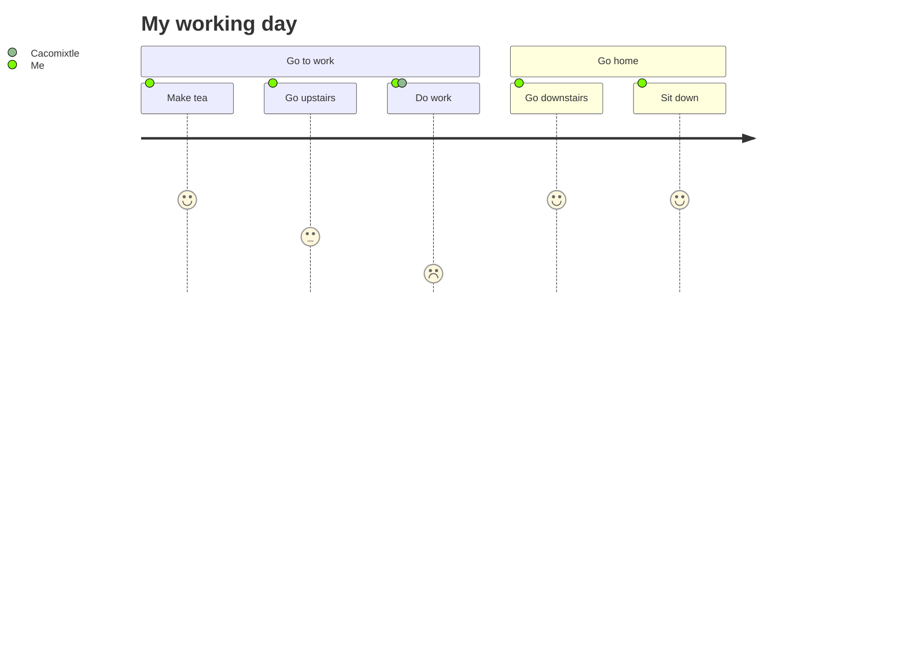

 


- 👋 Hi, I’m @acmerev a Software Engineer
- 👀 I’m interested in Data Structures and Algorithms, Frontend Development, Backend Development, Database Management, System Design and Cloud.
- 🌱 I am currently studying a Master's Degree in Software Engineering at the Autonomous University of Tlaxcala.
- 💞️ I’m looking to collaborate in community projects and more...


[](https://github.com/anuraghazra/github-readme-stats)

[](https://github.com/anuraghazra/github-readme-stats)

[](https://github.com/anuraghazra/github-readme-stats)


<!---
acmerev/acmerev is a ✨ special ✨ repository because its `README.md` (this file) appears on your GitHub profile.
You can click the Preview link to take a look at your changes.
--->

acmerev@hotmail.com

```javascript

let emc = {
    name: 'Emmanuel',
    whois: 'Ingenier of Software',
    stack: 'Full',
    country: 'Mex'
    Tecs; {'HTML', 'CSS', 'JavaScrip', 'Bootstrap', 'Node.js','React'}
};

```
## Technologies I'm Learning :books:

#### Software:

  
  
  
  
  
  
