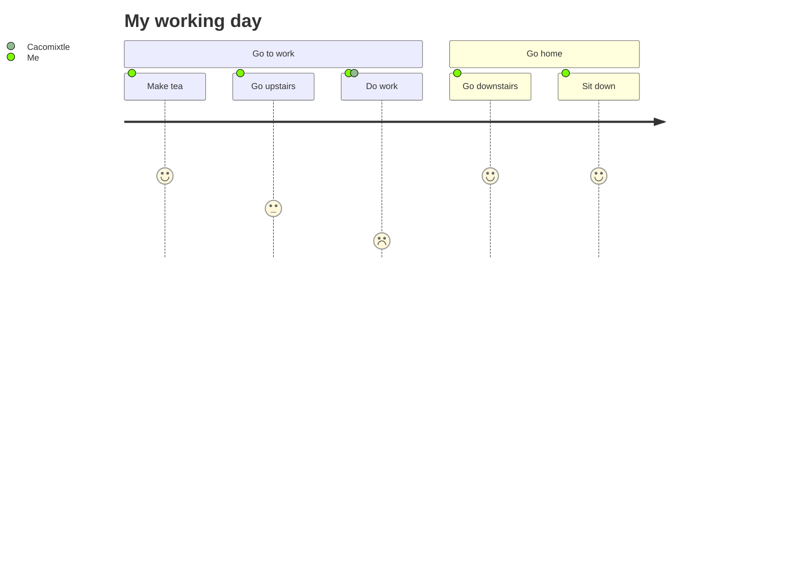

 
<div align="center" >

👋 Hi, I’m @acmerev a Software Engineer
👀 I’m interested in Data Structures and Algorithms, Frontend Development, Backend Development, Database Management, System Design and Cloud.
🌱 I am currently studying a Master's Degree in Software Engineering at the Autonomous University of Tlaxcala.
💞️ I’m looking to collaborate in community projects and more...


[](https://github.com/anuraghazra/github-readme-stats)

</div>

<!---
acmerev/acmerev is a ✨ special ✨ repository because its `README.md` (this file) appears on your GitHub profile.
You can click the Preview link to take a look at your changes.
--->



acmerev@hotmail.com

```javascript

 let emc = {
        name: 'Emmanuel',
        whois: 'Software engineer',
        stack: 'Full',
        country: 'Mex',
        Tecs: ['HTML', 'CSS', 'JavaScrip', 'Bootstrap', 'Node.js','React']
    };

```
<div align="center" >
## Technologies I'm Learning :books:

#### Software:

  
  
  
  
  
</div> 
 
<details close="true">
  <summary><b>:gear: &nbsp;More About me</b></summary>
  
  
 
 
 
  </details>
  
  <details close="true">
  <summary><b>:gear: &nbsp;Languages and Tools</b></summary>
 -------------------

                       
  
<br>

[](https://github.com/ryo-ma/github-profile-trophy)

<br>

-------------------

 
 </details>


<details close="true">
  <summary><b>:gear: &nbsp;Book's</b></summary>
</details>


