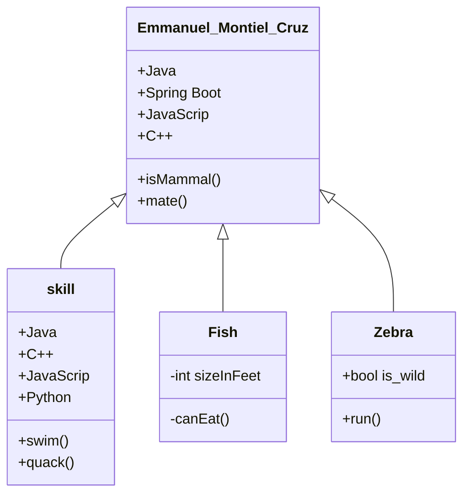
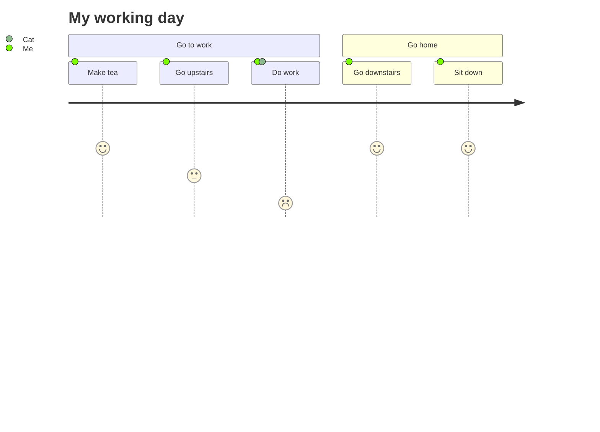

## Emmanuel Montiel Cruz 
Software Ingenier

Bio

I am a Full stack Developer with industry experience building websites and web applications. I specialize in JavaScript and have professional experience working with Java, C, Vue, nodejs, angular, react, python.


### RESUME

I´m Ingenier in Computer science Gradruate of Univerity Autonomus of Tlaxcala and pasion for Data Structures and Algorithms, Frontend Development, Backend Development, Database Management, System Design and Cloud.


```markdown
Estudios 
## Sistemas Distribuidos.
Universidad Autonoma de Tlaxcala
Programa Licenciatura en Ingenieria en Computacion 
2005-2010

## Maestria en Ingeniria de Software
Universidad Autonoma de Tlaxcala 
Programa de Posgrado en Ingenieria de Softwarer  
2021-2023


## Skill´s
- JavaScript
- Java
- C++
- Python
- Go
- kotlyn

## Framework´s
1. Node.js
2. Vue.js

**Bold** and _Italic_ and `Code` text

[Link](url) and 
```


My day 



ormar recursos humanos capacitados en tecnologías de redes y sistemas distribuidos, para así diagnosticar, mantener las redes de datos y soportar servicios distribuidos que requieran de mecanismos de transporte e intercambio entre agentes.
